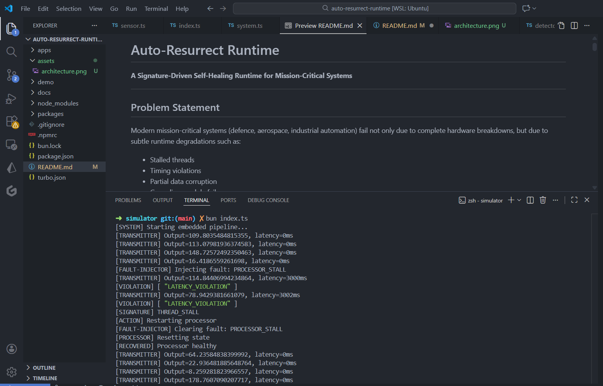
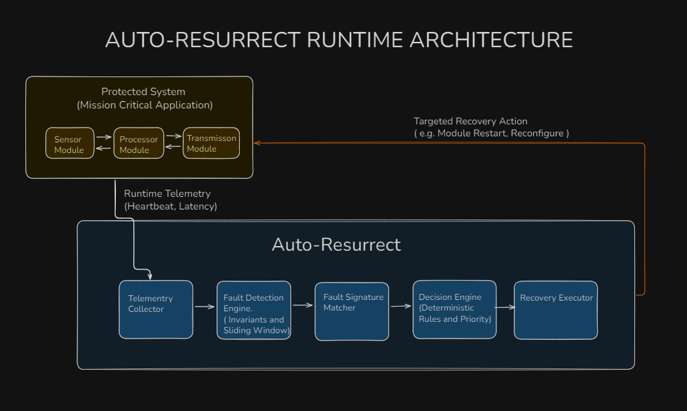

# Auto-Resurrect Runtime

**A Signature-Driven Self-Healing Runtime for Mission-Critical Systems**

---

## Problem Statement

Modern mission-critical systems (defence, aerospace, industrial automation) fail not only due to complete hardware breakdowns, but due to subtle runtime degradations such as:

- Stalled threads
- Timing violations
- Partial data corruption
- Cascading module failures

Existing resilience mechanisms treat failure as a binary event (alive / dead), leading to repeated resets, loss of context, and degraded operational continuity.

There is a need for a **self-healing runtime system** that can detect failure patterns, isolate faulty components, and autonomously reconfigure system behavior to maintain operation without full system restart.

**Domain:** IoT & Automation / Open Innovation  
**Inspiration:** Self-healing computing elements (SIH-25163)

---

## Why Existing Solutions Fail

*Unlike watchdog timers that only detect “alive/dead” states, Auto-Resurrect Runtime reasons about failure patterns and adapts system behavior instead of repeatedly resetting the system.*

| Existing Approach | Why It's Insufficient |
|-------------------|----------------------|
| **Watchdog Timers** | Binary logic (alive/dead). Blind resets with no diagnosis. Repeated reset loops (e.g., Mars Pathfinder). |
| **Process Managers (PM2, systemd)** | Restart services but cannot reason about why failure occurred or adapt behavior. |
| **Hardware Redundancy Alone** | Wastes resources; does not handle software-level degradations or partial failures. |
| **Kubernetes-style Self-Healing** | Designed for cloud services, not embedded / real-time systems. No fault semantics. |

**➡️ All of the above react to failure. None understand it.**

---

##  Core Insight

> **Failures are not binary. They leave signatures.**

Instead of restarting systems blindly, Auto-Resurrect Runtime:

1. Observes invariant violations
2. Matches them to known fault signatures
3. Executes context-aware recovery actions

This mirrors how FPGA partial reconfiguration works conceptually — bypassing faulty blocks instead of rebooting the entire system.

---

## System Overview

Auto-Resurrect Runtime sits beside the system it protects.

**It does not replace:**
- Application logic
- OS scheduler
- Hardware watchdogs

Instead, it acts as an **intelligent supervisory runtime**.

**Core Loop:**
```
Observe → Detect → Classify → Decide → Recover → Continue
```

---

## Project Flow & Logic

1. The protected system emits runtime telemetry (latency, heartbeat).
2. Telemetry is continuously evaluated against predefined invariants.
3. Invariant violations are collected over a sliding time window.
4. Correlated violations are matched against known fault signatures.
5. A deterministic decision engine selects the safest recovery action.
6. Recovery is applied only to the affected module.
7. System execution continues without full restart.

```
Telemetry → Invariants → Signatures → Decision → Recovery
```

## Current Prototype Status (Round 1)

The current implementation demonstrates:

- A simulated embedded-style processing pipeline (Sensor → Processor → Transmitter)
- Real-time telemetry generation (latency, heartbeat)
- Deterministic invariant checks (latency bounds)
- Temporal fault detection using sliding windows
- Fault signature classification (e.g., THREAD_STALL)
- Autonomous recovery via targeted module restart
- Continued system operation without full restart

Hardware-level reconfiguration and FPGA mapping are demonstrated conceptually and planned for later stages.

---

## Failure Detection Engine (Low-Level & Deterministic)

### What We Monitor

The system defines **invariants** — properties that must always hold.

**Examples:**
- Module heartbeat interval ≤ 200ms
- Response latency within time window


### How Detection Works

- Metrics are sampled over sliding time windows
- Comparators detect violations
- Violations generate fault signals

**Important:**
```
Invariant Violation ≠ Failure
Multiple correlated violations = Fault Signature
```

**No ML. No heuristics. Fully deterministic.**

---

## Decision Engine

The decision engine maps **fault signatures → recovery actions** using a rule-based priority system.

### Example Fault Mapping

| Fault Signature | Root Cause | Action |
|----------------|------------|--------|
| Heartbeat loss + CPU spike | Thread deadlock | Restart module |
| Latency spike + checksum errors | Data corruption | Switch to redundant module |
| Repeated restarts | Persistent fault | Graceful degradation |

### Safety Rules

- Never restart the entire system unless unavoidable
- Prefer isolation over reset
- Preserve system continuity

---

## Recovery Actions

Auto-Resurrect Runtime can:

- Restart only the faulty module
- Switch execution to a redundant module
- Bypass degraded paths
- Reduce functionality gracefully
- Escalate only if recovery fails

> **We do not heal hardware.**  
> **We reconfigure system behavior around faulty components.**

---

## Demo Walkthrough 

### 🎥 Demo Video  

👉 [](https://d14k6sh16ssaej.cloudfront.net/round1_Demo.mp4)  


**Scenario: CPU Stall in Processing Module**

1. System runs normally
2. **Fault injected:** processing module stalls
3. **Invariant violated:** heartbeat timeout
4. **Fault signature matched:** thread stall
5. **Decision engine selects:** module restart
6. Module recovers
7. System continues operation


**Console output clearly shows:**
```
[VIOLATION] → [SIGNATURE] → [ACTION] → [RECOVERED]
```

✔ No full restart  
✔ No manual intervention

---

## How to Run the Demo

```bash
cd apps/simulator
bun install
bun index.ts
```

## System Architecture Diagram

  


---

## Limitations (Intentional & Explicit)

- Does not repair physical hardware
- Hardware fault detection is simulated
- Partial FPGA reconfiguration is conceptual, not physical
- Designed as a runtime layer, not a standalone OS

**➡️ These are conscious design choices for clarity and feasibility.**

---

## Round-2 Expansion Plan

Planned improvements:

- Hierarchical monitoring (module → subsystem → system)
- Persistent vs transient fault classification
- Graceful degradation strategies
- Mapping runtime logic to FPGA partial reconfiguration
- Distributed self-healing (multi-node)
- Formal fault taxonomy

---

## License

*Add your license information here*

## Contributing

*Add contribution guidelines here*

## Contact

*Add contact information here*