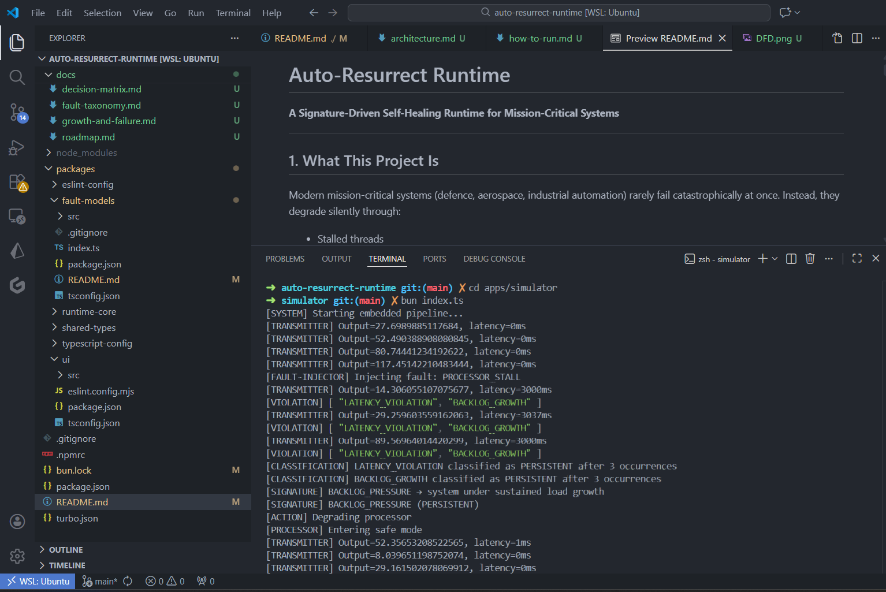

# Auto-Resurrect Runtime

**A Signature-Driven Self-Healing Runtime for Mission-Critical Systems**

---

## 1. What This Project Is

Modern mission-critical systems (defence, aerospace, industrial automation) rarely fail catastrophically at once. Instead, they degrade silently through:

- Stalled threads
- Timing violations
- Partial data corruption
- Cascading module failures

Most resilience mechanisms treat failure as binary (alive/dead), leading to blind restarts, loss of context, and repeated failure loops.

**Auto-Resurrect Runtime** is a supervisory runtime that:

- Detects degradation patterns, not just crashes
- Classifies failures deterministically
- Recovers affected components without full system restart

**Domain:** IoT & Automation / Open Innovation  
**Inspiration:** Self-healing computing elements (SIH-25163)

---

## 2. Why Existing Solutions Fail

Unlike watchdog timers that only detect "alive/dead" states, Auto-Resurrect Runtime reasons about why a failure is happening and adapts system behavior instead of repeatedly resetting it.

| Existing Approach | Why It's Insufficient |
|-------------------|----------------------|
| **Watchdog Timers** | Binary logic. Blind resets. Repeated reset loops (e.g., Mars Pathfinder). |
| **Process Managers (PM2, systemd)** | Restart services but cannot diagnose root cause or adapt behavior. |
| **Hardware Redundancy Alone** | Costly; does not address software-level or partial failures. |
| **Cloud-style Self-Healing (Kubernetes)** | Designed for cloud workloads, not embedded or real-time systems. |

**➡️ All of the above react to failure. None understand it.**

---

## 3. Core Insight

> **Failures are not binary. They leave signatures.**

Auto-Resurrect Runtime follows a deterministic reasoning loop:

```
Observe → Detect → Classify → Decide → Recover → Continue
```

Instead of rebooting entire systems, it isolates faulty components and reconfigures execution paths — conceptually similar to FPGA partial reconfiguration.

All classification and recovery decisions are **deterministic, bounded, and explainable** — a deliberate design choice for safety-critical systems.

---

## 4. Design Principles

The system is guided by a small set of explicit design principles:

- **Determinism over heuristics**
- **Isolation over global restart**
- **Classification before recovery**

These principles ensure predictable behavior under failure and load.

---

## 5. System at a Glance

**High-level flow:**

1. Runtime telemetry is emitted by system modules
2. Telemetry is evaluated against invariants
3. Violations are correlated over time
4. Fault signatures are matched
5. A deterministic decision engine selects a recovery action
6. Recovery is applied only to the affected module
7. System execution continues without full restart

For detailed architecture and data-flow diagrams, see:  
 📄 Detailed Architecture Docs:[`docs/architecture.md`](docs/architecture.md) 

---

## 6. How the System Handles Failures (Round-2 Focus)

Auto-Resurrect Runtime explicitly distinguishes **transient degradation** from **persistent faults**.

### Key Concepts

- Invariant violations ≠ failures
- Fault persistence is determined via repeated invariant violations over time (count-based thresholding)
- Persistent faults are emitted once, preventing recovery oscillations
- Multiple correlated violations form a fault signature
- Persistent signatures trigger graceful degradation, not repeated restarts

### Supported Recovery Strategies

- Targeted module restart
- Bypassing degraded execution paths
- Reduced-capacity operation (graceful degradation)
- Sustained backlog pressure detection under load growth
- Escalation only when recovery repeatedly fails

📄 Detailed fault taxonomy: [`docs/fault-taxonomy.md`](docs/fault-taxonomy.md)

📄 Signature → action mapping:[`docs/decision-matrix.md`](docs/decision-matrix.md) 

---

## 7. How the System Handles Growth

The architecture is designed to scale without centralized bottlenecks:

- Runtime instances are replicable per node
- Invariant evaluation is local and stateless
- Fault decisions are deterministic and bounded
- Backpressure is detected via backlog accumulation, not instantaneous thresholds
- Distributed deployments coordinate via lightweight control-plane signals

**This enables:**

- Horizontal scaling across devices or subsystems
- Isolation of failures without system-wide impact
- Predictable behavior under sustained load

📄 Scaling and failure-avoidance strategy: [`docs/growth-and-failure.md`](docs/growth-and-failure.md) 

---

## 8. Current Implementation Status

### ✅ What Is Implemented (Prototype)

- Simulated embedded processing pipeline (Sensor → Processor → Transmitter)
- Real-time telemetry (latency, heartbeat)
- Deterministic invariant evaluation
- Sliding-window / count-based violation correlation
- Fault persistence classification (TRANSIENT vs PERSISTENT)
- Fault signature matching (e.g., THREAD_STALL, BACKLOG_PRESSURE)
- Targeted recovery actions with state reset
- Continued operation without full system restart

### 🔮 What Is Conceptual / Planned

- Hardware-level FPGA partial reconfiguration
- Distributed multi-node self-healing
- Extended fault-models library (CPU, IO, memory, network)

📄 Roadmap: [`docs/roadmap.md`](docs/roadmap.md) 

---

## 9. Demo & Reproducibility

### 🎥 Demo Video  

[](https://d14k6sh16ssaej.cloudfront.net/round2_Demo.mp4)  

### Fault Scenario Demonstrated: Processor Stall → Backlog Pressure

1. System runs normally with stable latency
2. **Fault injected:** processor execution stall
3. **Invariants violated:** 
    - Latency bound exceeded
    - Backlog growth detected
4. **Violations persist across multiple cycles**
5. **Fault persistence classified after threshold (3 occurrences)**
6. **Fault signature matched: BACKLOG_PRESSURE**
7. **Recovery action executed: processor degraded to safe mode**
8. **System latency stabilizes and execution continues**

```
[VIOLATION] → [PERSISTENCE] → [SIGNATURE] → [ACTION] → [STABILIZED]

```

✔ No full system restart
✔ No recovery oscillation
✔ Persistent fault handled once
✔ System continues under degraded but stable operation

📄 Scenario details: [Demo Scenarios](demo/scenarios.md)  
📄 How to run: [How to Run the Demo](demo/how-to-run.md)

---

## Repository Structure

```
apps/
  simulator/        # Embedded-style runtime simulation
packages/
  runtime-core/     # Invariants, detectors, decision engine
  fault-models/     # Formal fault taxonomy (conceptual)
  shared-types/     # Shared runtime contracts
docs/               # Architecture, scaling, decisions
demo/               # Fault scenarios & execution guide
```

---

## Team Contributions

| Team Member | Responsibility |
|------------|----------------|
| **Umang Pokhriyal** | System architecture, invariant modeling |
| **Aryan Gairola** | Fault injection simulator, telemetry pipeline |
| **Rahul Rawat** | Signature matching, decision engine |
| **Vashu Chauhan** | Recovery execution logic, documentation, demo scenarios |

All members contributed through code, design discussions, testing, and validation.

---

## Limitations (Intentional)

- Does not repair physical hardware
- Hardware faults are simulated
- FPGA reconfiguration is conceptual
- Designed as a runtime layer, not a standalone OS

**These are conscious design choices to focus on runtime intelligence and clarity.**

---

## License & Contact

**License:** MIT  
**Team Lead:** Umang Pokhriyal  
**GitHub:** [https://github.com/umangPokhriyall](https://github.com/umangPokhriyall)

---

## 🚀 Getting Started

*Add installation and quick start instructions here*

## 🤝 Contributing

*Add contribution guidelines here*

## 📚 Documentation

For comprehensive documentation, please refer to the [`docs/`](docs) directory:

- Architecture overview
- Fault taxonomy
- Decision matrix
- Scaling strategy
- Roadmap