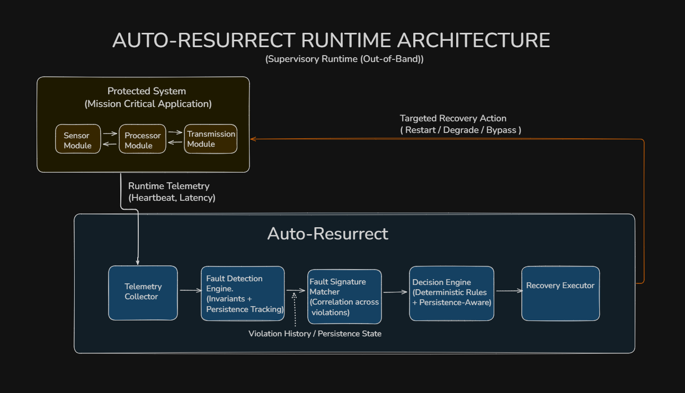
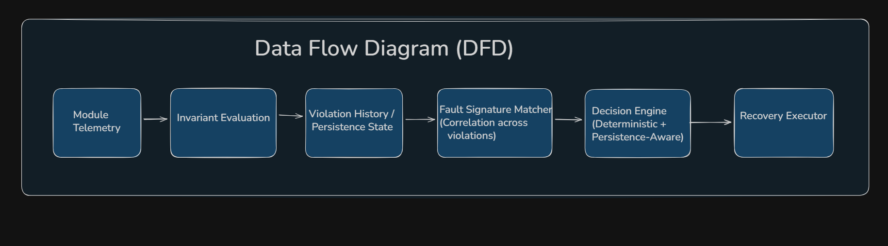

# System Architecture

This document describes how Auto-Resurrect Runtime integrates with a protected system, how data flows through the runtime, and how recovery actions are applied.

---

## High-Level Architecture

The system consists of two clearly separated parts.

### Protected System

A mission-critical application composed of runtime modules:

- **Sensor Module**
- **Processor Module**
- **Transmitter Module**

These modules execute application logic and emit runtime telemetry such as latency measurements and heartbeat timestamps.

---

### Auto-Resurrect Runtime

**Supervisory, Out-of-Band Runtime**

An external supervisory runtime that continuously observes system behavior and applies targeted recovery actions without replacing application logic, schedulers, or the underlying operating system.

---

## Data Flow Diagram (DFD)

The runtime operates as a deterministic, multi-stage reasoning pipeline:

---

## Pipeline Explanation

1. Runtime telemetry is continuously emitted by system modules
2. Invariants evaluate whether safety and timing properties hold
3. Repeated invariant violations are correlated over time
4. Persistence state distinguishes transient degradation from persistent faults
5. Correlated violations form fault signatures
6. The decision engine selects the minimal recovery action required
7. Recovery is applied only to the affected module

---

## Planes of Operation

### Telemetry Plane

- Metrics emitted by system modules
- Stateless and high-frequency
- Includes latency, heartbeat, and backlog-related signals
- Local to each runtime instance

### Control Plane

- Invariant evaluation
- Violation history and persistence tracking
- Fault signature matching across signals
- Deterministic, bounded decision logic

### Recovery Plane

- Targeted module restart
- Graceful degradation (safe-mode execution)
- Execution-path bypassing
- Never impacts unrelated modules

---

## Local vs Distributed Responsibility

**Current prototype behavior:**

- Invariant evaluation → local
- Persistence tracking → local
- Signature matching → local
- Decision execution → local

Future extensions may introduce lightweight coordination across nodes, but the core runtime logic remains fully functional in isolation.

---

## Architectural Intent

Auto-Resurrect Runtime is designed as a **supervisory, out-of-band runtime**.

It does not replace application code, schedulers, watchdogs, or operating systems.

**Its purpose is to:**

- Interpret failure patterns over time
- Classify degradation deterministically
- Apply minimal, context-aware recovery actions
- Preserve forward progress without full system restarts

---

## Key Design Decisions

### Why Out-of-Band?

By operating separately from the protected system, the runtime:

- Avoids interference with application execution
- Maintains observability even during system degradation
- Can make recovery decisions independently
- Reduces coupling between supervision and application logic

### Why Deterministic?

Safety-critical systems require:

- Predictable behavior under all conditions
- Explainable recovery decisions
- Bounded execution time
- No probabilistic or heuristic-based actions

### Why Local-First?

- Minimizes latency in detection and recovery
- Eliminates dependencies on network availability
- Scales horizontally without coordination overhead
- Maintains system resilience even in distributed failure scenarios

---

## Scalability Considerations

### Horizontal Scaling

- Each node runs an independent runtime instance
- No shared state required for core functionality
- Telemetry and recovery remain local
- Optional coordination layer for system-wide policies

### Vertical Scaling

- Invariant evaluation is O(1) per metric
- Signature matching complexity bounded by fault taxonomy size
- Decision engine uses lookup tables for constant-time selection
- Memory footprint scales with violation history window size

---

## Integration Points

### With Existing Systems

The runtime can integrate with:

- **RTOS environments** via scheduler hooks
- **Linux systems** via process monitoring
- **FPGA platforms** via partial reconfiguration APIs (conceptual)
- **Container orchestrators** as a sidecar supervisor

### Required Interfaces

Minimal integration requirements:

1. **Telemetry emission** from protected modules
2. **Recovery action callbacks** for module restart/reconfiguration
3. **Configuration interface** for invariant definitions

---

## Next Steps

- See [`docs/fault-taxonomy.md`](docs/fault-taxonomy.md)  for failure classification details
- See [`docs/decision-matrix.md`](docs/decision-matrix.md)  for signature → action mappings
- See [`docs/growth-and-failure.md`](docs/growth-and-failure.md)  for scaling strategies